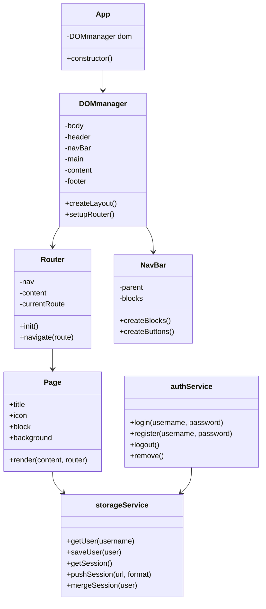

# Documentación Técnica - La página Hueb

## **1. Arquitectura del sistema**

### 1.1 Descripción general

El proyecto es una **Single Page Application (SPA)** desarrollada en JavaScript puro, que utiliza **la API del navegador (`localStorage`)** como capa de persistencia local en lugar de una base de datos externa. La aplicación se organiza de manera modular siguiendo principios de **Programación Orientada a Objetos (POO)** y **separación de responsabilidades**.

- **Capa principal:** `App.js` inicia la aplicación y orquesta la interfaz y el enrutamiento.
- **Capa de presentación (UI):** componentes dentro de `/components/` (DOMmanager, NavBar, Page y páginas concretas).
- **Capa de enrutamiento:** `Router.js` gestiona la navegación entre vistas sin recargar la página.
- **Capa de servicios:** `/services/` implementa la lógica de persistencia (autenticación, sesión, almacenamiento local).
- **Capa de datos y utilidades:** `/data/` provee funciones de construcción de elementos y datos base del sistema.

####  Diagrama de clases y flujo de datos (Mermaid)

Este diagrama resume el flujo principal:
`App` → `DOMmanager` → `Router` → `Page` → `Storage/Auth Service`

El flujo de datos parte del usuario y su interacción (botones o formularios) hacia el `Router`, que renderiza la página correspondiente, y de ahí se comunica con `storageService` o `authService` para mantener el estado o registrar acciones en `localStorage`.

***

## **2. Diseño y UX**

### 2.1 Justificación de decisiones de interfaz

- **Diseño minimalista:** se prioriza la limpieza visual para adaptación a móvil y el enfoque en el contenido.
- **Navegación declarativa:** la `NavBar` usa botones icónicos con etiquetas asociadas.
- **Uso de una sola página:** se mejora el rendimiento y la continuidad de la experiencia.
- **Feedback inmediato:** cuando el usuario captura un gato o inicia sesión, la interfaz se actualiza dinámicamente sin recargar.
- **Consistencia visual:** componentes reutilizables (`card`, `review`, `text`) mantienen coherencia estética.

### 2.2 Flujo de usuario

1. Accede a la página inicial.
2. Explora contenido o genera una nueva imagen vía TheCatAPI.
3. Si lo desea, crea una cuenta local o inicia sesión (sin backend real).
4. Su sesión y estadísticas se guardan en `localStorage`.

***

## **3. Gestión del trabajo**

### 3.1 Organización
El proyecto fue llevado a cabo utilizando una extensión de Visual Studio Code llamada Koban, que permite organizar tareas con distintos niveles de prioridad. Al ser un proyecto individual, me permitió organizar mejor el tiempo y los recursos para llevar a cabo cada idea.

Muchas de ellas se quedaron pendientes por motivos de tiempo, pero la organización general de la estructura inicial del proyecto permitió su posible integración futura de forma simplificada y eficiente.

Se puede acceder a las tareas [aquí](changelog/.tasks/tasks-2026.md).

***

## **4. Conclusiones y desafíos técnicos**

### 4.1 Desafíos encontrados

- La sincronía entre sesión temporal `SESSION_DATA_KEY` y los datos persistentes del usuario fue todo un desafío, ya que había que reorientar los agregados a la clave de `data` del usuario y la estructura no era reutilizable. 
- Manejar la limpieza de la sesión según las acciones que toma el usuario: Según el orden de invocación en `authService.js` las imágenes se agregaban por duplicado durante las pruebas.
- Diseñar una navegación fluida sin frameworks externos partiendo desde cero, sin saber cuánto tiempo tomaría empezar a integrar metadatos y la lógica para un mini-juego.
- Gestión segura y coherente de `localStorage` (manejo de errores y parsing).
- Integración de la API externa `theCatAPI` con manejo de errores y asincronía. Inicialmente se había proyectado con la API `random-d.uk` pero surgieron limitaciones de CORS y usar el proxy a través de `api.allorigins.win` devolvía excesivos errores de servidor (5xx).

### 4.2 Soluciones aplicadas

- Implementación de funciones modulares (`build`, `buildBlock`, `pushSession`).
- Uso de **clases y servicios** para encapsular lógica de estado.
- Cacheo de assets y precarga ligera desde `DOMmanager`.
- Validaciones robustas y modelos de usuario independientes.

### 4.3 Pruebas
- El flujo de pruebas utilizado para comprobar la funcionalidad y la persistencia de la sesión se realizó a partir del `inspector tools` del navegador `Chromium` en la pestaña `Console` o `Application` para visualizar claves locales existentes en el `localStorage`.

#### Test 1
1. `user` Click sobre el botón de desconexión
    - Comprobar que `currentUser` se elimina.

#### Test 2
1. `user` Crear varios usuarios repitiendo Test 1 * 3.
    - Hacer click sobre el botón de desconexión
    - Comprobar que `currentUser` se elimina.
    - Comprobar persistencia de datos individualmente.
    - Hace login en cuenta existente.

#### Test 3
1. `modB` Llamar a la API para insertar datos.
2. Cambiar de pestaña (cualquiera)
3. `modB` Comprobar persistencia de imagen.

#### Test 4
1. `modB` Llamar a la API para insertar datos * 3.
2. `user` Registrar nuevo usuario
    1. Comprobar unión de datos en la clave `huebUser:user` `data{}`. Lo que incluye `clicksTotal`, `formats`, `images`.
    2. Comprobar limpieza de datos exceptuando `activeImage` en la clave `currentSession`
3. `modB` Llamar a la API para insertar datos * 3.
4. `user`
    1. Comprobar unión de datos en la clave `huebUser:user` `data{}`. Lo que incluye `clicksTotal`, `formats`, `images`.
    2. Hacer un `logout()`.
    3. Comprobar que la clave `currentUser` se borra.
5. `modB` Llamar a la API para insertar datos * 3.
    1. Comprobar unión de datos en la clave `currentSession`. Lo que incluye `clicksTotal`, `formats`, `images`.

#### Test 5
1. `user` Hacer click sobre el botón de eliminar cuenta
    - comprobar que tanto `currentUser` como `huebUser:user` se eliminan.

#### Test 6
1. `user` Crear varios usuarios con distintas estadísticas. 
    - Estando registrado, hacer click sobre el botón de eliminar cuenta y comprobar que tanto `currentUser` como la clave relacionada en `huebUser:user` se eliminan.

### 4.4 Conclusiones

Ha sido una experiencia entretenida dado el tiempo que se pudo utilizar. Tanto la documentación como parte del código ha requerido el apoyo de LLMs para sugerir ideas o corrección de bloques, como por ejemplo en `UserPage.js` hacia el final del proyecto para un refactor indispensable, ya que el bloque anterior no cumplía requerimientos SOLID de manera evidente al ser un condicional de muchas lineas. La LLM también fue muy útil para las plantillas de generación de documentación, su organización y fraseado inicial, incluyendo la elaboración de un README.md más completo.

***

jonathan

